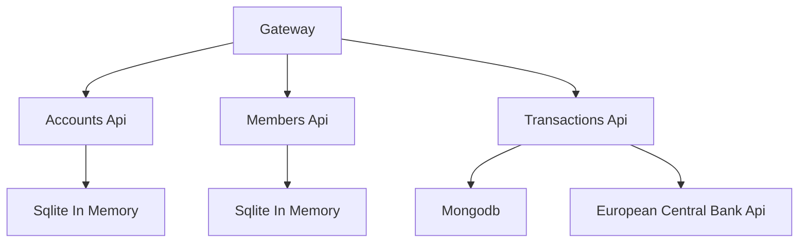

#  Simple Building Society 

This project currently contains 4 microservices structured like:

Additionally all services use redis to coordinate the graph.

## Why Graphql

* Data Fetching
  * No under or over fetching
* Schema & Type Safety
* Stitching allows us to integrate anything into the graphql

## Docs
* [Queries](docs/Queries.md)
* [Mutations](docs/Mutations.md)
* [Subscriptions](docs/Subscriptions.md)
* [Relay](docs/Relay.md)

## Endpoints
* Heathchecks Ui http://localhost:9001/healthchecks-ui
  * This will check all endpoints & databases are available
* Federated Gateway schema explorer http://localhost:9001/graphql

## To run
* Run `docker compose up` in the src folder

Some data will be generated and stored in memory.

### Presentation Plan

What is graphql...
What are the main components...
What is federaton...

Show how to run a basic query
- talk about the result format
- Query name/params
- Intellisense
- Recursive
- Variables
- Polymorphic
- Freedom from schema
- Projection, sorting, paging, filter

Mutations
How run mutations batching

Subscriptions
Show a subscription running
Mention current limit

Healthchecks

Open telemetry
Soon to have redis and mongo

Integration Testing

