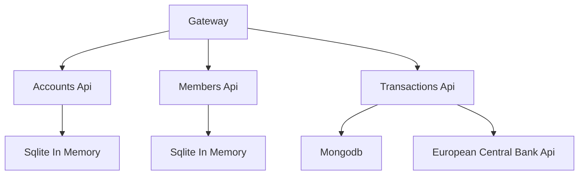

#  Simple Building Society 

This project currently contains 4 microservices structured like:

Additionally all services use redis to coordinate the graph.

## Why Graphql

* Data Fetching
  * No under or over fetching
* Schema & Type Safety
* Stitching allows us to integrate anything into the graphql

## Docs
* [Queries](docs/Queries.md)
* [Mutations](docs/Mutations.md)
* [Subscriptions](docs/Subscriptions.md)
* [Relay](docs/Relay.md)
* [Open Telemetry](docs/Open_Telemetry.md)

## Endpoints
* Heathchecks Ui http://localhost:9001/healthchecks-ui
  * This will check all endpoints & databases are available
* Federated Gateway schema explorer http://localhost:9001/graphql

## To run
* Run `docker compose up` in the src folder

Some data will be generated and stored in memory.

### Presentation Plan

What is graphql...  Why?... One Api limitless flexibility
* Ask for what you need, get exactly that
* Get many resources in a single request
* Describe what’s possible with a type system
* No storage system deps, works with existing infra

What are the main components... 
* Gateway
* micro-services
* redis
* mongo
* ecb api

What is federation... Why?
* Show Schema  
* Discuss Stitching

Show how to run a basic query
* Talk about the result format
* Query name/Variables
* Intellisense
* Recursive
* Polymorphic
* Shared Schema
* Type Safety
* In Built projection, sorting, paging, filter

Mutations
* How run mutations batching
* How errors work

Subscriptions
* Show a subscription running
* Mention current limit

Misc
* Unit/Integration Testing
* Security
* Rate Limiting
* Caching
* Performance
* Health Checks
* Open telemetry

