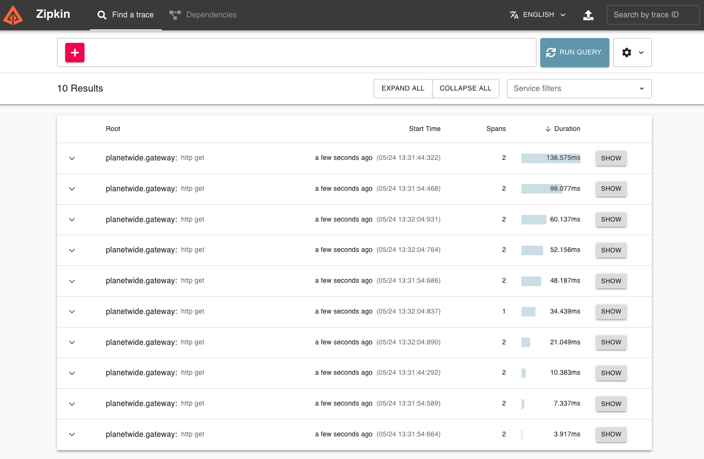
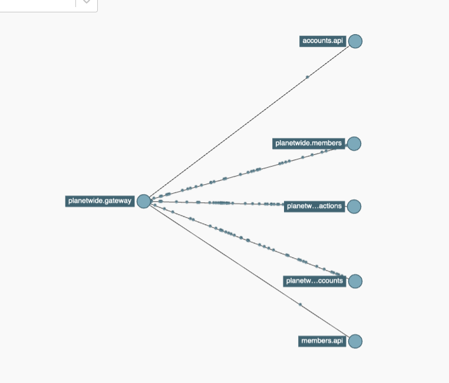

# Open Telemetry

Planetwide makes use of open telemetry to monitor its infrastructure.  The logs are available at http://localhost:9411

This encompasses all dependencies.
* Mongodb
* Redis
* Interservice Communication
* External Http Calls

## Logs

## Dependency Graph

