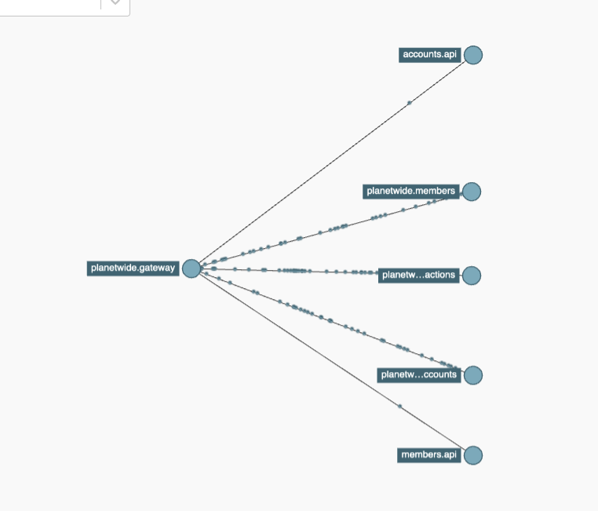

# Open Telemetry

Planetwide makes use of open telemetry to monitor its infrastructure.  The logs are available at http://localhost:9411

We can also track redis, mongo etc, I just haven't rigged it up

## Logs

## Dependency Graph

