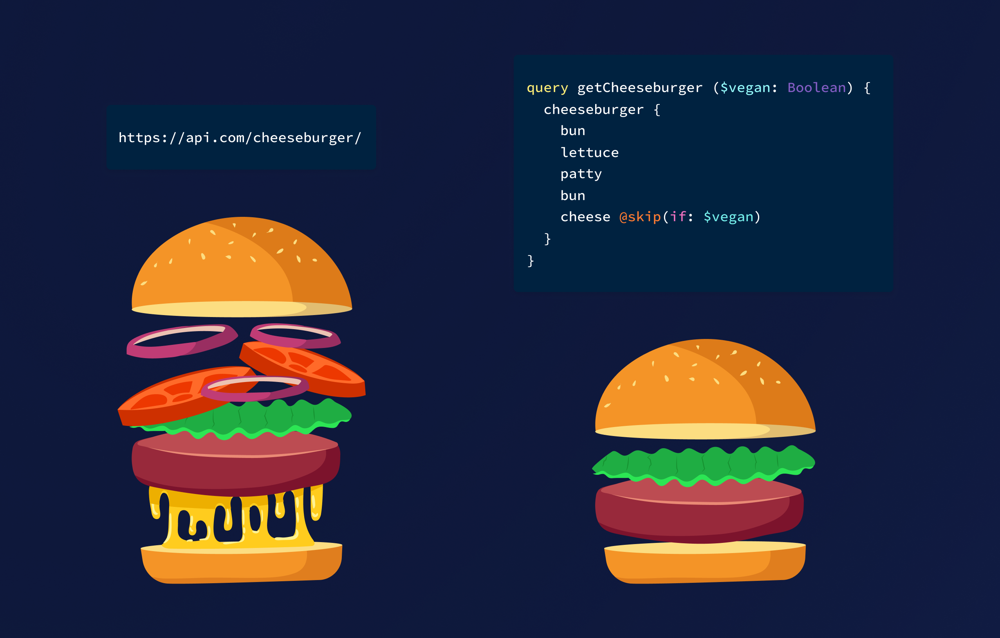

# Queries

See the graphql docs https://graphql.org/learn/queries/

## Query a member details



* Basic Details
* Marketing Preferences
* Accounts List
* Transactions

```graphql
query getMemberAccounts {
  member(memberId: "TWVtYmVyCmkx") {
    id
    firstname
    surname
    preferences {
      byPost
      byOnline
    }
    accounts {
      iban
      balance
      transactions {
        id
        amount
        reference
      }
    }
  }
}
```

## Batching Queries:

This allows us to request any set of entities we like
```
query getMemberAccounts {
  transactions(accountId: "QWNjb3VudAppMQ=="){
    amount
    reference
  }

  member(memberId: "TWVtYmVyCmkx") {
    preferences {
      byTelephone
      byEmail
    }
  }
}
```

